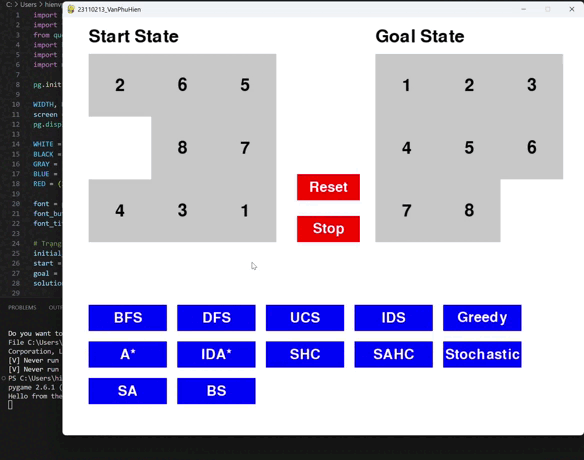
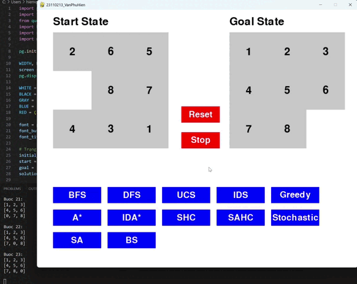
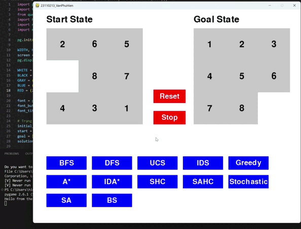
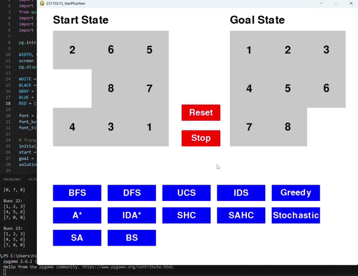
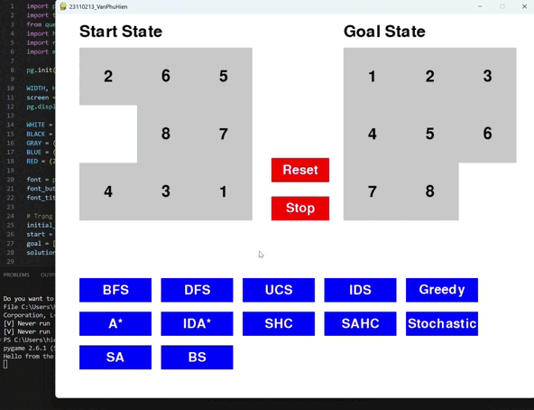

# Đồ án cá nhân cuối kỳ - AI

## 1. Mục tiêu

Đồ án tập trung vào xây dựng chương trình giải bài toán **8-puzzle** nhằm mục tiêu tìm hiểu, triển khai và đánh giá hiệu suất của các thuật toán tìm kiếm khi áp dụng vào bài toán — yêu cầu sắp xếp lại các ô số từ trạng thái ban đầu (Start State) sao cho đúng với trạng thái đích (Goal State) thông qua các hành động di chuyển hợp lệ.

Giao diện đồ họa (GUI) của chương trình được xây dựng bằng thư viện **Pygame**

> Sinh viên thực hiện [Văn Phú Hiền - 23110213](#)

## Mục lục - Các nhóm thuật toán

- [I. Uninformed Search Algorithms](#i-uninformed-search-algorithms)  
  - [1. bfs – Breadth-First Search](#1-bfs--breadth-first-search)  
  - [2. dfs – Depth-First Search](#2-dfs--depth-first-search)  
  - [3. ucs – Uniform Cost Search](#3-ucs--uniform-cost-search)  
  - [4. ids – Iterative Deepening Search](#4-ids--iterative-deepening-search)  

- [II. Informed Search Algorithms](#ii-informed-search-algorithms)  
  - [1. a_star – A* Search](#1-a_star--a-search)  
  - [2. greedy – Greedy Best-First Search](#2-greedy--greedy-best-first-search)  
  - [3. ida_star – Iterative Deepening A*](#3-ida_star--iterative-deepening-a)  

- [III. Local Search Algorithms](#iii-local-search-algorithms)  
  - [1. SHC – Simple Hill Climbing](#1-SHC--simple-hill-climbing)  
  - [2. SAHC – Steepest Ascent Hill Climbing](#2-SAHC--steepest-ascent-hill-climbing)  
  - [3. Stochastic – Stochastic Hill Climbing](#3-Stochastic--stochastic-hill-climbing)  
  - [4. SA – Simulated Annealing](#4-SA--simulated-annealing)  
  - [5. BS – Beam Search](#5-BS--beam-search)

## 2. Nội dung

### 2.1. Uninformed Search Algorithms (Các thuật toán tìm kiếm không có thông tin)

#### 2.1.1. Các thành phần chính của bài toán tìm kiếm và giải pháp
- **Không gian trạng thái**: Ma trận 3x3 biểu diễn vị trí các ô số và ô trống.
- | Trạng thái bắt đầu | Trạng thái đích |
  |--------------------|---------------------|
  |  |  |
- **Tập hành động**: Lên, xuống, trái phải.
- **Chi phí**: Mỗi bước di chuyển có chi phí bằng 1.
- **Giải pháp**: 

#### 2.1.2. Hình ảnh gif của từng thuật toán khi áp dụng lên trò chơi
#### **1. bfs – Breadth-First Search**

#### **2. dfs – Depth-First Search**

#### **3. ucs – Uniform Cost Search**

#### **4. ids – Iterative Deepening Search**

---

## 2.2. Informed Search Algorithms (Các thuật toán tìm kiếm có thông tin)

### 1. a_star – A* Search

### 2. greedy – Greedy Best-First Search

### 3. ida_star – Iterative Deepening A*

---

## 2.3. Local Search Algorithms (Các thuật toán tìm kiếm cục bộ)

### 1. SHC – Simple Hill Climbing

### 2. SAHC – Steepest Ascent Hill Climbing

### 3. Stochastic – Stochastic Hill Climbing

### 4. SA – Simulated Annealing

### 5. BS – Beam Search

