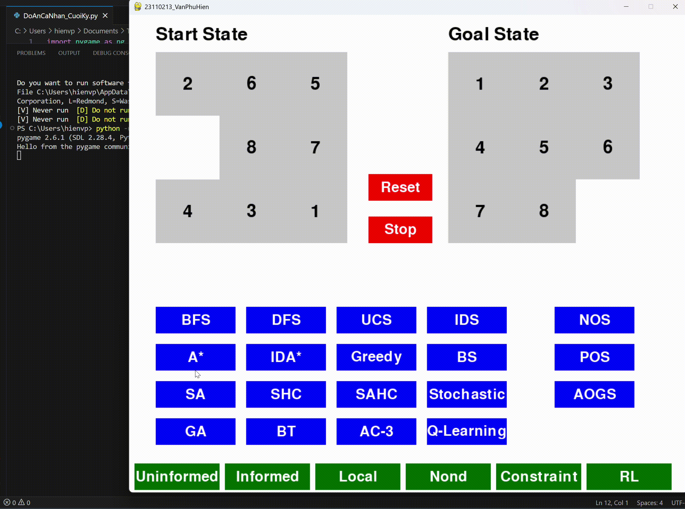

# Đồ án cá nhân cuối kỳ - AI
- Sinh viên thực hiện [Văn Phú Hiền - 23110213](#) 
- Mã lớp học: **ARIN330585_04**
- Giảng viên hướng dẫn: **TS. Phan Thị Huyền Trang**

## Mục lục
- [1. Giới thiệu chung](#1-giới-thiệu-chung)  
- [2. Mục tiêu](#2-mục-tiêu)  
- [3. Nội dung](#3-nội-dung)
  - [3.1. Uninformed Search Algorithms (Các thuật toán tìm kiếm không có thông tin)](#31-uninformed-search-algorithms-các-thuật-toán-tìm-kiếm-không-có-thông-tin)
    - [3.1.1. Các thành phần chính của bài toán tìm kiếm và Solution](#311-các-thành-phần-chính-của-bài-toán-tìm-kiếm-và-solution)
    - [3.1.2. Hình ảnh gif của từng thuật toán khi áp dụng lên trò chơi](#312-hình-ảnh-gif-của-từng-thuật-toán-khi-áp-dụng-lên-trò-chơi)
      - [BFS - Breadth First Search](#bfs--breadth-first-search)
      - [DFS - Depth First Search](#dfs--depth-first-search)
      - [UCS - Uniform Cost Search](#ucs--uniform-cost-search)
      - [IDS - Iterative Deepening Search](#ids--iterative-deepening-search)
    - [3.1.3. Hình ảnh so sánh hiệu suất của các thuật toán](#313-hình-ảnh-so-sánh-hiệu-suất-của-các-thuật-toán)
    - [3.1.4. Nhận xét](#314-nhận-xét)
  - [3.2. Informed Search Algorithms (Các thuật toán tìm kiếm có thông tin)](#32-informed-search-algorithms-các-thuật-toán-tìm-kiếm-có-thông-tin)
    - [3.2.1. Các thành phần chính của bài toán tìm kiếm và Solution](#321-các-thành-phần-chính-của-bài-toán-tìm-kiếm-và-solution)
    - [3.2.2. Hình ảnh gif của từng thuật toán khi áp dụng lên trò chơi](#322-hình-ảnh-gif-của-từng-thuật-toán-khi-áp-dụng-lên-trò-chơi)
      - [Greedy - Greedy Best First Search](#greedy--greedy-best-first-search)
      - [A Star - A Star Search](#a-star--a-star-search)
      - [IDA Star - Iterative Deepening A Star](#ida-star--iterative-deepening-a-star)
    - [3.2.3. Hình ảnh so sánh hiệu suất của các thuật toán](#323-hình-ảnh-so-sánh-hiệu-suất-của-các-thuật-toán)
    - [3.2.4. Nhận xét](#324-nhận-xét)
  - [3.3. Local Search Algorithms (Các thuật toán tìm kiếm cục bộ)](#33-local-search-algorithms-các-thuật-toán-tìm-kiếm-cục-bộ)
    - [3.3.1. Các thành phần chính của bài toán tìm kiếm và Solution](#331-các-thành-phần-chính-của-bài-toán-tìm-kiếm-và-solution)
    - [3.3.2. Hình ảnh gif của từng thuật toán khi áp dụng lên trò chơi](#332-hình-ảnh-gif-của-từng-thuật-toán-khi-áp-dụng-lên-trò-chơi)
      - [SHC - Simple Hill Climbing](#shc--simple-hill-climbing)
      - [SAHC - Steepest Ascent Hill Climbing](#sahc--steepest-ascent-hill-climbing)
      - [Stochastic - Stochastic Hill Climbing](#stochastic--stochastic-hill-climbing)
      - [BS - Beam Search](#bs--beam-search)
      - [SA - Simulated Annealing](#sa--simulated-annealing)
      - [GA - Genetic Algorithm](#ga--genetic-algorithm)
    - [3.3.3. Hình ảnh so sánh hiệu suất của các thuật toán](#333-hình-ảnh-so-sánh-hiệu-suất-của-các-thuật-toán)
    - [3.3.4. Nhận xét](#334-nhận-xét)
  - [3.4. Searching with Nondeterminism (Tìm kiếm trong môi trường không xác định)](#34-searching-with-nondeterminism-tìm-kiếm-trong-môi-trường-không-xác-định)
    - [3.4.1. Các thành phần chính của bài toán tìm kiếm và Solution](#341-các-thành-phần-chính-của-bài-toán-tìm-kiếm-và-solution)
    - [3.4.2. Hình ảnh gif của từng thuật toán khi áp dụng lên trò chơi](#342-hình-ảnh-gif-của-từng-thuật-toán-khi-áp-dụng-lên-trò-chơi)
      - [AOGS - AND-OR Graph Search](#aogs--and--or-graph-search)
      - [NOS - No Observable Search](#nos--no-observable-search)
      - [POS - Partial Observable Search](#pos--partial-observable-search)
    - [3.4.3. Hình ảnh so sánh hiệu suất của các thuật toán](#343-hình-ảnh-so-sánh-hiệu-suất-của-các-thuật-toán)
    - [3.4.4. Nhận xét](#344-nhận-xét)
  - [3.5. Searching with Constraint Satisfaction (Tìm kiếm có ràng buộc)](#35-searching-with-constraint-satisfaction-tìm-kiếm-có-ràng-buộc)
    - [3.5.1. Các thành phần chính của bài toán tìm kiếm và Solution](#351-các-thành-phần-chính-của-bài-toán-tìm-kiếm-và-solution)
    - [3.5.2. Hình ảnh gif của từng thuật toán khi áp dụng lên trò chơi](#352-hình-ảnh-gif-của-từng-thuật-toán-khi-áp-dụng-lên-trò-chơi)
      - [BT - Backtracking](#bt--backtracking)
      - [AC-3](#ac--3)
    - [3.5.3. Hình ảnh so sánh hiệu suất của các thuật toán](#353-hình-ảnh-so-sánh-hiệu-suất-của-các-thuật-toán)
    - [3.5.4. Nhận xét](#354-nhận-xét)
  - [3.6. Reinforcement Learning (Học tăng cường)](#36-reinforcement-learning-học-tăng-cường)
    - [3.6.1. Các thành phần chính của bài toán tìm kiếm và Solution](#361-các-thành-phần-chính-của-bài-toán-tìm-kiếm-và-solution)
    - [3.6.2. Hình ảnh gif của thuật toán khi áp dụng lên trò chơi](#362-hình-ảnh-gif-của-thuật-toán-khi-áp-dụng-lên-trò-chơi)
      - [Q - Learning](#q--learning)
    - [3.6.3. Hình ảnh hiệu suất của thuật toán](#363-hình-ảnh-hiệu-suất-của-thuật-toán)
    - [3.6.4. Nhận xét](#364-nhận-xét)
- [4. Kết luận](#4-kết-luận)

  
## 1. Giới thiệu chung
- Đồ án xây dựng game giải bài toán **8-puzzle** có áp dụng các thuật toán tìm kiếm để tìm lời giải, chương trình được thiết kế với giao diện đơn giản, trực quan để người dùng dễ dàng tương tác và lựa chọn thuật toán phù hợp.
- Giao diện đồ họa (GUI) của chương trình được xây dựng bằng thư viện **Pygame**.
- Giao diện chính của chương trình:

Trong giao diện trên gồm:
- **Start State**: Trạng thái bắt đầu.
- **Goal State**: Trạng thái đích.
- **Nút màu xanh dương**: Các thuật toán tìm kiếm.
- **Nút màu xanh lá**: Biểu đồ hiệu suất hoạt động của thuật toán dựa trên thời gian thực thi.
- **Nút màu đỏ**: **Reset** dùng để đặt lại trạng thái đầu, **Stop** dùng để ngưng việc giải nếu cần.

## 2. Mục tiêu
Đồ án tập trung vào xây dựng chương trình giải bài toán **8-puzzle** nhằm mục tiêu tìm hiểu, triển khai và đánh giá hiệu suất của các thuật toán tìm kiếm khi áp dụng vào bài toán — yêu cầu sắp xếp lại các ô số từ trạng thái bắt đầu (Start State) sao cho đúng với trạng thái đích (Goal State) thông qua các hành động di chuyển hợp lệ.

## 3. Nội dung
### 3.1. Uninformed Search Algorithms (Các thuật toán tìm kiếm không có thông tin)
#### 3.1.1. Các thành phần chính của bài toán tìm kiếm và Solution
- **Không gian trạng thái**: Ma trận 3x3 biểu diễn vị trí các ô số và ô trống.
- | Trạng thái bắt đầu | Trạng thái đích |
  |--------------------|---------------------|
  |  |  |
- **Tập hành động**: Lên, xuống, trái, phải.
- **Chi phí**: Mỗi bước di chuyển có chi phí bằng 1.
- **Solution**: Một chuỗi các trạng thái được áp dụng các hành động để chuyển từ trạng thái bắt đầu sang trạng thái đích.

#### 3.1.2. Hình ảnh gif của từng thuật toán khi áp dụng lên trò chơi
- #### BFS – Breadth First Search
  
- #### DFS – Depth First Search
  
- #### UCS – Uniform Cost Search 
  
- #### IDS – Iterative Deepening Search 
  

#### 3.1.3. Hình ảnh so sánh hiệu suất của các thuật toán

#### 3.1.4. Nhận xét
Qua quá trình triển khai và chạy thử các thuật toán trong nhóm tìm kiếm không có thông tin trên, có thể thấy:
- **BFS** và **UCS**: Đảm bảo được lời giải tối ưu nhất, nhưng sẽ tiêu tốn nhiều bộ nhớ nhất do phải lưu trữ hàng đợi lớn.
- **DFS**: Tiết kiệm bộ nhớ hơn nhờ sử dụng ngăn xếp nhưng do duyệt sâu nên sẽ dễ bị kẹt ở nhánh sâu, không đảm bảo được đường đi tối ưu.
- **IDS**: Kết hợp cả ưu điểm của **BFS** và **DFS**, tìm kiếm theo độ sâu tăng dần nên tìm được lời giải tối ưu và hiệu quả cho bài toán 8-puzzle.

Thông qua biểu đồ so sánh thời gian thực thi của các thuật toán trên thì: **DFS** tuy nhiều bước giải nhưng có thời gian thực thi nhanh nhất, tiếp đến là **BFS** và **UCS** không chênh lệch thời gian bao nhiêu, cuối cùng là **IDS** mặc dù có lời giải tối ưu nhưng thời gian thực thi của thuật toán này là chậm nhất.

---

### 3.2. Informed Search Algorithms (Các thuật toán tìm kiếm có thông tin)
#### 3.2.1. Các thành phần chính của bài toán tìm kiếm và Solution
- **Không gian trạng thái**: Ma trận 3x3 biểu diễn vị trí các ô số và ô trống.
- | Trạng thái bắt đầu | Trạng thái đích |
  |--------------------|---------------------|
  |  |  |
- **Tập hành động**: Lên, xuống, trái, phải.
- **Chi phí**: Mỗi bước di chuyển có chi phí bằng 1.
- **Hàm tính toán chi phí**: f(n) = h(n) + g(n). Trong đó:
  - h(n): hàm Heuristic dùng để tính toán chi phí tối ưu dựa trên cách tính khoảng cách Manhattan.
  - g(n): số bước di chuyển các ô từ trạng thái bắt đầu đến trạng thái hiện tại.
  - f(n): tổng chi phí ước lượng từ trạng thái bắt đầu qua trạng thái hiện tại đến trạng thái đích.
- **Solution**: Một chuỗi các trạng thái được áp dụng các hành động dựa trên hàm tính toán chi phí để chuyển từ trạng thái bắt đầu sang trạng thái đích.

#### 3.2.2. Hình ảnh gif của từng thuật toán khi áp dụng lên trò chơi
- #### Greedy – Greedy Best First Search
  
- #### A Star – A Star Search
  
- #### IDA Star – Iterative Deepening A Star
  

#### 3.2.3. Hình ảnh so sánh hiệu suất của các thuật toán

#### 3.2.4. Nhận xét
Qua quá trình triển khai và chạy thử các thuật toán trong nhóm tìm kiếm có thông tin trên, có thể thấy:
- **Greedy**: Giải nhanh nhờ hàm chi phí Heuristic nhưng không đảm bảo tối ưu được do dễ bị kẹt ở trạng thái, không dẫn đến được mục tiêu.
- **A Star**: Hiệu quả cao, đảm bảo lời giải tối ưu nhờ kết hợp chi phi đường đi g(n) và hàm Heuristic h(n) nhưng tốn nhiều bộ nhờ do trạng thái được lưu trữ bằng hàng đợi ưu tiên.
- **IDA Star**: Tiết kiệm bộ nhớ hơn A Star, phù hợp với không gian trạng thái lớn.

Thông qua biểu đồ so sánh thời gian thực thi của các thuật toán trên thì: Greedy có thời gian thực thi nhanh nhất, tiếp đến là A Star và cuối cùng, chậm nhát là IDA Star.

---

### 3.3. Local Search Algorithms (Các thuật toán tìm kiếm cục bộ)
#### 3.3.1. Các thành phần chính của bài toán tìm kiếm và Solution
- **Không gian trạng thái**: Ma trận 3x3 biểu diễn vị trí các ô số và ô trống.
- | Trạng thái bắt đầu | Trạng thái đích |
  |--------------------|---------------------|
  |  |  |
- **Tập hành động**: Lên, xuống, trái, phải.
- **Chi phí**: Mỗi bước di chuyển có chi phí bằng 1.
- **Hàm tính toán chi phí**: chủ yếu tính toán dựa trên khoảng cách Manhattan để chọn trạng thái lân cận tốt nhất.
- **Solution**: Một chuỗi các trạng thái được áp dụng các hành động dựa trên hàm tính toán chi phí để chuyển từ trạng thái bắt đầu sang trạng thái đích.

#### 3.3.2. Hình ảnh gif của từng thuật toán khi áp dụng lên trò chơi
- #### SHC – Simple Hill Climbing
  
- #### SAHC – Steepest Ascent Hill Climbing
  
- #### Stochastic – Stochastic Hill Climbing
  
- #### BS – Beam Search
  
- #### SA – Simulated Annealing
  
- #### GA – Genetic Algorithm
  

#### 3.3.3. Hình ảnh so sánh hiệu suất của các thuật toán

#### 3.3.4. Nhận xét
Qua quá trình triển khai và chạy thử các thuật toán trong nhóm tìm kiếm cục bộ trên, có thể thấy:
- **Simple Hill Climbing** và **Steepest Ascent Hill Climbing**: 2 thuật toán này chủ yếu xét trạng thái lân cận, chỉ di chuyển cục bộ nên thường bị kẹt ở giới hạn cục bộ, do đó không có lời giải trong bài toán 8-puzzle.
- **Stochastic** và **Simulated Annealing**: nhờ có cơ chế chọn ngẫu nhiên trạng thái lân cận và chấp nhận trạng thái xấu hơn nên sẽ khắc phục được việc bị kẹt so với 2 thuật toán **Simple Hill Climbing** và **Steepest Ascent Hill Climbing** nhưng không đảm bảo lời giải tối ưu. Trong bài toán này thì **Stochastic** sẽ không có lời giải, còn **Simulated Annealing** phụ thuộc vào việc trạng thái lân cận chọn ngẫu nhiên nếu tốt sẽ có thể tìm ra lời giải.
- **Beam Search**: Nhanh, tiết kiệm bộ nhớ nhưng dễ bỏ qua lời giải tốt nhất do đặc điểm giới hạn trạng thái.
- **Genetic Algorithm**: Phù hợp để tối ưu hóa phức tạp nhưng do cơ chế xét trên quần thể trạng thái quá lớn dẫn đến chậm và không hiệu quả cho bài toán 8-puzzle.

Thông qua biểu đồ so sánh thời gian thực thi của các thuật toán trên thì: **Beam Search** có thời gian thực thi nhanh nhất, theo sau đó là **Stochastic**, tiếp đến là **Simulated Annealing**, và chậm nhất là **Genetic Algorithm**. Vì cả 2 thuật toán **Simple Hill Climbing** và **Steepest Ascent Hill Climbing** trong bài toán này đều bị kẹt ở trạng thái dẫn đến tự động thoát sớm nên việc hiển thị thời gian thực thi của 2 thuật toán này không có.

---

### 3.4. Searching with Nondeterminism (Tìm kiếm trong môi trường không xác định)
#### 3.4.1. Các thành phần chính của bài toán tìm kiếm và Solution
- **Không gian trạng thái**: Ma trận 3x3 biểu diễn vị trí các ô số và ô trống trên không gian niềm tin. Trong đó, ở môi trường không nhìn thấy gì thì cả trạng thái bắt đầu và trạng thái đích sẽ là ngẫu nhiên. Còn đối với trong môi trường chỉ nhìn thấy một phần thì chỉ trạng thái đầu là ngẫu nhiên, còn trạng thái đích sẽ cố định 3 ô nhìn thấy được là [1, 2, 3], các ô còn lại sẽ là không xác định.
- **Đối với cây AND-OR**:
- | Trạng thái bắt đầu | Trạng thái đích |
  |--------------------|---------------------|
  |  |  |
- **Đối với trong môi trường không nhìn thấy gì**:
- | Trạng thái bắt đầu | Trạng thái đích |
  |--------------------|---------------------|
  | Ngẫu nhiên | Ngẫu nhiên |
- **Đối với trong môi trường chỉ nhìn thấy một phần**:
- | Trạng thái bắt đầu | Trạng thái đích |
  |--------------------|---------------------|
  | Ngẫu nhiên |  |
- **Tập hành động**: Lên, xuống, trái, phải.
- **Chi phí**: Mỗi bước di chuyển có chi phí bằng 1.
- **Solution**: Một chuỗi các trạng thái được áp dụng các hành động dựa trên không gian niềm tin để chuyển từ trạng thái đầu ngẫu nhiên sang trạng thái đích trong môi trường không xác định.

#### 3.4.2. Hình ảnh gif của từng thuật toán khi áp dụng lên trò chơi
- #### AOGS – AND–OR Graph Search
  
- #### NOS – No Observable Search
  
- #### POS – Partial Observable Search
  

#### 3.4.3. Hình ảnh so sánh hiệu suất của các thuật toán

#### 3.4.4. Nhận xét
Qua quá trình triển khai và chạy thử các thuật toán trong nhóm tìm kiếm cục bộ trên, có thể thấy:
- **AND-OR Graph Search**: Tìm kiếm trên đồ thị cây AND-OR, phải xử lý nhiều nhánh phức tạp, mặc dù linh hoạt nhưng không tối ưu cho bài toán 8-puzzle.
- **No Observable Search** và **Partial Observable Search**: Hiệu quả trong môi trường không xác định nhờ hoạt động trên không gian niềm tin, nhưng sử dụng bộ nhớ rất lớn do phải xử lý không gian niềm tin lớn. **Partial Observable Search** sẽ hoạt động hiệu quả hơn **No Observable Search** vì giảm được không gian tìm kiếm nhờ có quan sát một phần đã được cố định, trong bài toán này là hàng đầu cố định [1, 2, 3].

Thông qua biểu đồ so sánh thời gian thực thi của các thuật toán trên thì: **Partial Observable Search** thực thi nhanh nhất, tiếp đến là **AND-OR Graph Search**, chậm nhất là **No Observable Search**.

---

### 3.5. Searching with Constraint Satisfaction (Tìm kiếm có ràng buộc)
#### 3.5.1. Các thành phần chính của bài toán tìm kiếm và Solution
- **Không gian trạng thái**: Ma trận 3x3 biểu diễn vị trí các ô số và ô trống.
- | Trạng thái bắt đầu | Trạng thái đích |
  |--------------------|---------------------|
  |  |  |
- **Tập hành động**: Lên, xuống, trái, phải.
- **Biến**: Các ô trên ma trận 3x3.
- **Miền giá trị**: Các số từ 0 đến 8.
- **Ràng buộc**: Mỗi số chỉ xuất hiện một lần và các bước di chuyển phải hợp lệ.
- **Chi phí**: Mỗi bước di chuyển có chi phí bằng 1.
- **Solution**: Một trạng thái phải thỏa mãn tất cả các ràng buộc.
  
#### 3.5.2. Hình ảnh gif của từng thuật toán khi áp dụng lên trò chơi
- #### BT – Backtracking
  
- #### AC – 3
  

#### 3.5.3. Hình ảnh so sánh hiệu suất của các thuật toán

#### 3.5.4. Nhận xét
Qua quá trình triển khai và chạy thử các thuật toán trong nhóm tìm kiếm có ràng buộc trên, có thể thấy:
- **Backtracking**: Đơn giản, tìm lời giải chậm do cơ chế đệ quy quay lui thử nhiều nhánh để tìm trạng thái hợp lệ.
- **AC – 3**: Hiệu quả hơn nhờ giảm miền giá trị trước khi tìm kiếm và áp dụng **Backtracking** để quay lui lại tìm lời giải nhưng do CSP không phù hợp trong bài toán này, do đó không tìm được lời giải.

Thông qua biểu đồ so sánh thời gian thực thi của các thuật toán trên thì: **Backtracking** có thời gian thực thi nhanh nhất.

---

### 3.6. Reinforcement Learning (Học tăng cường)
#### 3.6.1. Các thành phần chính của bài toán tìm kiếm và Solution
- **Không gian trạng thái**: Ma trận 3x3 biểu diễn vị trí các ô số và ô trống.
- | Trạng thái bắt đầu | Trạng thái đích |
  |--------------------|---------------------|
  |  |  |
- **Tập hành động**: Lên, xuống, trái, phải.
- **Agent**: Học cách di chuyển dựa trên giá trị Q-value được lưu trữ trong bảng Q-table.
- **Q-table** là một bảng lưu trữ các cặp trạng thái và hành động. Trong đó, **Q-value** là số thực biểu thị mức độ hữu ích của hành động trong trạng thái đó, giúp cho **Agent** chọn được đường đi tốt nhất.
- **Hàm thưởng**: +0 nếu đạt được mục tiêu, -1 cho mỗi bước di chuyển không hiệu quả.
- **Solution**: Một chính sách tối ưu để đạt được trạng thái đích.
  
#### 3.6.2. Hình ảnh gif của thuật toán khi áp dụng lên trò chơi
- #### Q – Learning
  

#### 3.6.3. Hình ảnh hiệu suất của thuật toán

#### 3.6.4. Nhận xét
Qua quá trình triển khai và chạy thử thuật toán **Q – Learning** trong nhóm **Học tăng cường**, có thể thấy: nhờ việc học qua nhiều lần thử, thuật toán này phù hợp trong bài toán học từ kinh nghiệm, nhưng trong bài toán 8-puzzle này, do không gian trạng thái lớn và số lần thử (5000 episodes, tối đa 500 bước mỗi episode) không đủ để đạt được chính sách tối ưu, dẫn đến không tìm được lời giải.

## 4. Kết luận
Qua việc triển khai và xây dựng đồ án game 8-puzzle này, một số kết quả mà đồ án này đạt được như sau:
- Triển khai được 19 thuật toán thuộc 6 nhóm gồm: Nhóm thuật toán tìm kiếm không có thông tin, tìm kiếm có thông tin, tìm kiếm cục bộ, tìm kiếm trong môi trường không xác định, tìm kiếm có ràng buộc và học tăng cường.
- Tích hợp các thuật toán vào giao diện Pygame để trực quan hóa quá trình giải bài toán 8-puzzle.
- So sánh hiệu suất thuật toán qua biểu đồ thời gian thực thi, giúp nhìn rõ tốc độ xử lý của các thuật toán trong từng nhóm.
- Có hình ảnh gif minh họa của từng thuật toán, giúp cho việc quan sát các bước giải được rõ ràng hơn.
- Có nhận xét chi tiết về cách hoạt động của thuật toán, những ưu điểm và nhược điểm, từ đó làm rõ vấn đề ứng dụng thực tế của các thuật toán.
