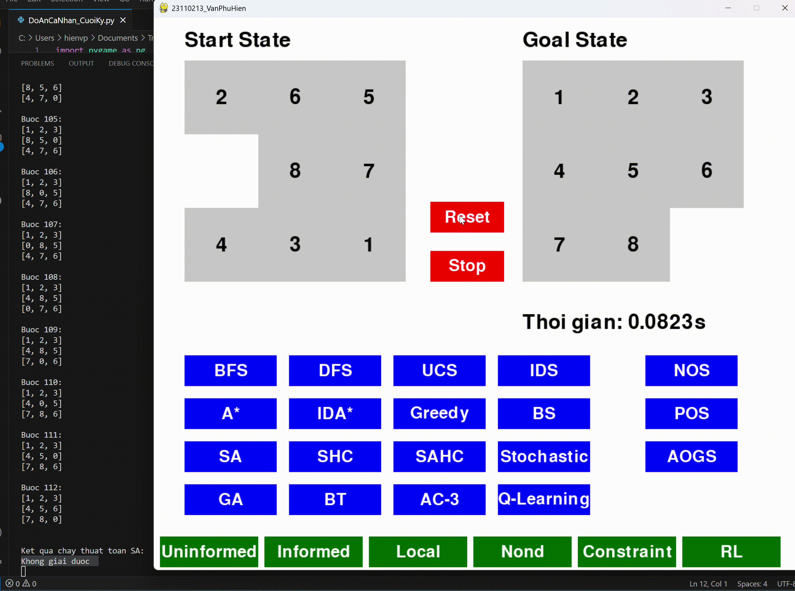
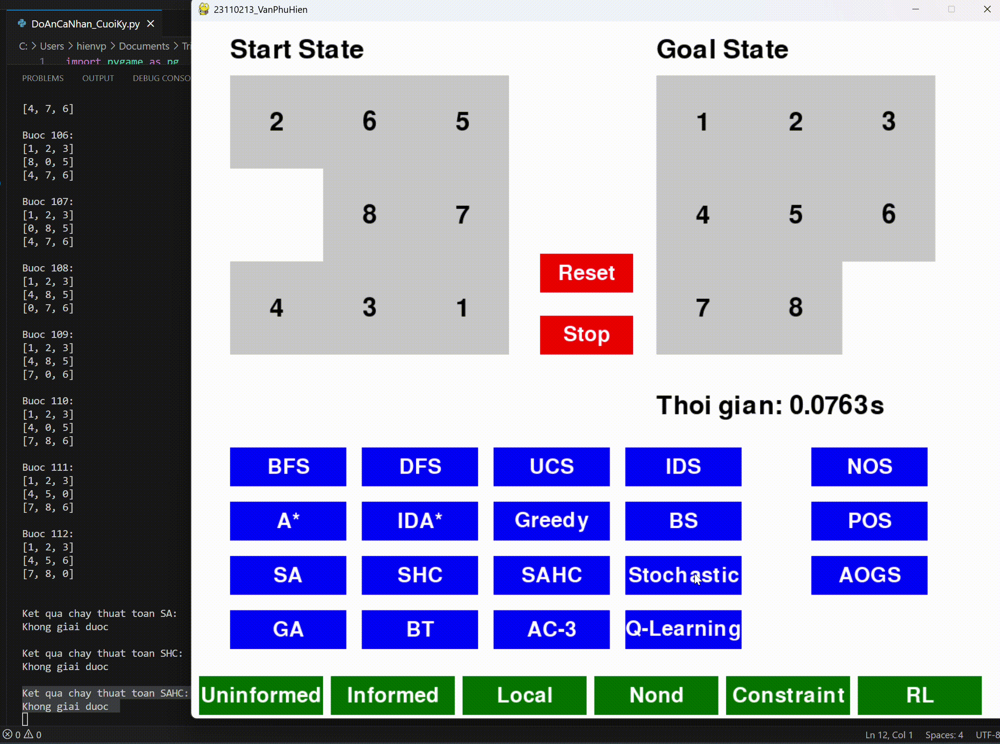

# Đồ án cá nhân cuối kỳ - AI
- Sinh viên thực hiện [Văn Phú Hiền - 23110213](#) 
- Mã lớp học: **ARIN330585_04**
- Giảng viên hướng dẫn: **TS. Phan Thị Huyền Trang**

## Mục lục
- [1. Giới thiệu chung](#1-giới-thiệu-chung)  
- [2. Mục tiêu](#2-mục-tiêu)  
- [3. Nội dung](#3-nội-dung)
  - [3.1. Uninformed Search Algorithms (Các thuật toán tìm kiếm không có thông tin)](#31-uninformed-search-algorithms-các-thuật-toán-tìm-kiếm-không-có-thông-tin)
    - [3.1.1. Các thành phần chính của bài toán tìm kiếm và Solution](#311-các-thành-phần-chính-của-bài-toán-tìm-kiếm-và-solution)
    - [3.1.2. Hình ảnh gif của từng thuật toán khi áp dụng lên trò chơi](#312-hình-ảnh-gif-của-từng-thuật-toán-khi-áp-dụng-lên-trò-chơi)
      - [BFS - Breadth First Search](#bfs--breadth-first-search)
      - [DFS - Depth First Search](#dfs--depth-first-search)
      - [UCS - Uniform Cost Search](#ucs--uniform-cost-search)
      - [IDS - Iterative Deepening Search](#ids--iterative-deepening-search)
    - [3.1.3. Hình ảnh so sánh hiệu suất của các thuật toán](#313-hình-ảnh-so-sánh-hiệu-suất-của-các-thuật-toán)
    - [3.1.4. Nhận xét](#314-nhận-xét)
  - [3.2. Informed Search Algorithms (Các thuật toán tìm kiếm có thông tin)](#32-informed-search-algorithms-các-thuật-toán-tìm-kiếm-có-thông-tin)
    - [3.2.1. Các thành phần chính của bài toán tìm kiếm và Solution](#321-các-thành-phần-chính-của-bài-toán-tìm-kiếm-và-solution)
    - [3.2.2. Hình ảnh gif của từng thuật toán khi áp dụng lên trò chơi](#322-hình-ảnh-gif-của-từng-thuật-toán-khi-áp-dụng-lên-trò-chơi)
      - [Greedy - Greedy Best First Search](#greedy--greedy-best-first-search)
      - [A Star - A Star Search](#a-star--a-star-search)
      - [IDA Star - Iterative Deepening A Star](#ida-star--iterative-deepening-a-star)
    - [3.2.3. Hình ảnh so sánh hiệu suất của các thuật toán](#323-hình-ảnh-so-sánh-hiệu-suất-của-các-thuật-toán)
    - [3.2.4. Nhận xét](#324-nhận-xét)
  - [3.3. Local Search Algorithms (Các thuật toán tìm kiếm cục bộ)](#33-local-search-algorithms-các-thuật-toán-tìm-kiếm-cục-bộ)
    - [3.3.1. Các thành phần chính của bài toán tìm kiếm và Solution](#331-các-thành-phần-chính-của-bài-toán-tìm-kiếm-và-solution)
    - [3.3.2. Hình ảnh gif của từng thuật toán khi áp dụng lên trò chơi](#332-hình-ảnh-gif-của-từng-thuật-toán-khi-áp-dụng-lên-trò-chơi)
      - [SHC - Simple Hill Climbing](#shc--simple-hill-climbing)
      - [SAHC - Steepest Ascent Hill Climbing](#sahc--steepest-ascent-hill-climbing)
      - [Stochastic - Stochastic Hill Climbing](#stochastic--stochastic-hill-climbing)
      - [BS - Beam Search](#bs--beam-search)
      - [SA - Simulated Annealing](#sa--simulated-annealing)
      - [GA - Genetic Algorithm](#ga--genetic-algorithm)
    - [3.3.3. Hình ảnh so sánh hiệu suất của các thuật toán](#333-hình-ảnh-so-sánh-hiệu-suất-của-các-thuật-toán)
    - [3.3.4. Nhận xét](#334-nhận-xét)
  - [3.4. Searching with Nondeterminism (Tìm kiếm trong môi trường không xác định)](#34-searching-with-nondeterminism-tìm-kiếm-trong-môi-trường-không-xác-định)
    - [3.4.1. Các thành phần chính của bài toán tìm kiếm và Solution](#341-các-thành-phần-chính-của-bài-toán-tìm-kiếm-và-solution)
    - [3.4.2. Hình ảnh gif của từng thuật toán khi áp dụng lên trò chơi](#342-hình-ảnh-gif-của-từng-thuật-toán-khi-áp-dụng-lên-trò-chơi)
      - [AOGS - AND-OR Graph Search](#aogs--and--or-graph-search)
      - [NOS - No Observable Search](#nos--no-observable-search)
      - [POS - Partial Observable Search](#pos--partial-observable-search)
    - [3.4.3. Hình ảnh so sánh hiệu suất của các thuật toán](#343-hình-ảnh-so-sánh-hiệu-suất-của-các-thuật-toán)
    - [3.4.4. Nhận xét](#344-nhận-xét)
  - [3.5. Searching with Constraint Satisfaction (Tìm kiếm có ràng buộc)](#35-searching-with-constraint-satisfaction-tìm-kiếm-có-ràng-buộc)
    - [3.5.1. Các thành phần chính của bài toán tìm kiếm và Solution](#351-các-thành-phần-chính-của-bài-toán-tìm-kiếm-và-solution)
    - [3.5.2. Hình ảnh gif của từng thuật toán khi áp dụng lên trò chơi](#352-hình-ảnh-gif-của-từng-thuật-toán-khi-áp-dụng-lên-trò-chơi)
      - [BT - Backtracking](#bt--backtracking)
      - [AC-3](#ac--3)
    - [3.5.3. Hình ảnh so sánh hiệu suất của các thuật toán](#353-hình-ảnh-so-sánh-hiệu-suất-của-các-thuật-toán)
    - [3.5.4. Nhận xét](#354-nhận-xét)
  - [3.6. Reinforcement Learning (Học tăng cường)](#36-reinforcement-learning-học-tăng-cường)
    - [3.6.1. Các thành phần chính của bài toán tìm kiếm và Solution](#361-các-thành-phần-chính-của-bài-toán-tìm-kiếm-và-solution)
    - [3.6.2. Hình ảnh gif của từng thuật toán khi áp dụng lên trò chơi](#362-hình-ảnh-gif-của-từng-thuật-toán-khi-áp-dụng-lên-trò-chơi)
      - [Q - Learning](#q--learning)
    - [3.6.3. Hình ảnh so sánh hiệu suất của các thuật toán](#363-hình-ảnh-so-sánh-hiệu-suất-của-các-thuật-toán)
    - [3.6.4. Nhận xét](#364-nhận-xét)

  
## 1. Giới thiệu chung
- Đồ án xây dựng game giải bài toán **8-puzzle** có áp dụng các thuật toán tìm kiếm để tìm lời giải, chương trình được thiết kế với giao diện đơn giản, trực quan để người dùng dễ dàng tương tác và lựa chọn thuật toán phù hợp.
- Giao diện chính của chương trình:

Trong giao diện trên gồm:
- **Start State**: Trạng thái bắt đầu.
- **Goal State**: Trạng thái đích.
- **Nút màu xanh dương**: Các thuật toán tìm kiếm.
- **Nút màu xanh lá**: Biểu đồ hiệu suất hoạt động của thuật toán dựa trên thời gian thực thi.
- **Nút màu đỏ**: **Reset** dùng để đặt lại trạng thái đầu, **Stop** dùng để ngưng việc giải nếu cần.

## 2. Mục tiêu
Đồ án tập trung vào xây dựng chương trình giải bài toán **8-puzzle** nhằm mục tiêu tìm hiểu, triển khai và đánh giá hiệu suất của các thuật toán tìm kiếm khi áp dụng vào bài toán — yêu cầu sắp xếp lại các ô số từ trạng thái bắt đầu (Start State) sao cho đúng với trạng thái đích (Goal State) thông qua các hành động di chuyển hợp lệ.
Giao diện đồ họa (GUI) của chương trình được xây dựng bằng thư viện **Pygame**

## 3. Nội dung
### 3.1. Uninformed Search Algorithms (Các thuật toán tìm kiếm không có thông tin)
#### 3.1.1. Các thành phần chính của bài toán tìm kiếm và Solution
- **Không gian trạng thái**: Ma trận 3x3 biểu diễn vị trí các ô số và ô trống.
- | Trạng thái bắt đầu | Trạng thái đích |
  |--------------------|---------------------|
  |  |  |
- **Tập hành động**: Lên, xuống, trái phải.
- **Chi phí**: Mỗi bước di chuyển có chi phí bằng 1.
- **Solution**: Một chuỗi các trạng thái được áp dụng các hành động để chuyển từ trạng thái bắt đầu sang trạng thái đích.

#### 3.1.2. Hình ảnh gif của từng thuật toán khi áp dụng lên trò chơi
- #### BFS - Breadth First Search
  
- #### DFS - Depth First Search
  
- #### UCS - Uniform Cost Search 
  
- #### IDS - Iterative Deepening Search 
  

#### 3.1.3. Hình ảnh so sánh hiệu suất của các thuật toán

#### 3.1.4. Nhận xét

---

### 3.2. Informed Search Algorithms (Các thuật toán tìm kiếm có thông tin)
#### 3.2.1. Các thành phần chính của bài toán tìm kiếm và Solution
- **Không gian trạng thái**: Ma trận 3x3 biểu diễn vị trí các ô số và ô trống.
- | Trạng thái bắt đầu | Trạng thái đích |
  |--------------------|---------------------|
  |  |  |
- **Tập hành động**: Lên, xuống, trái phải.
- **Chi phí**: Mỗi bước di chuyển có chi phí bằng 1.
- **Hàm tính toán chi phí**: f(n) = h(n) + g(n). Trong đó:
  - h(n): hàm Heuristic dùng để tính toán chi phí tối ưu dựa trên cách tính khoảng cách Manhattan.
  - g(n): số bước di chuyển các ô từ trạng thái bắt đầu đến trạng thái hiện tại.
  - f(n): tổng chi phí ước lượng từ trạng thái bắt đầu qua trạng thái hiện tại đến trạng thái đích.
- **Solution**: Một chuỗi các trạng thái được áp dụng các hành động dựa trên hàm tính toán chi phí để chuyển từ trạng thái bắt đầu sang trạng thái đích.

#### 3.2.2. Hình ảnh gif của từng thuật toán khi áp dụng lên trò chơi
- #### Greedy - Greedy Best First Search
  
- #### A Star - A Star Search
  
- #### IDA Star - Iterative Deepening A Star
  

#### 3.2.3. Hình ảnh so sánh hiệu suất của các thuật toán

#### 3.2.4. Nhận xét

---

### 3.3. Local Search Algorithms (Các thuật toán tìm kiếm cục bộ)
#### 3.3.1. Các thành phần chính của bài toán tìm kiếm và Solution
- **Không gian trạng thái**: Ma trận 3x3 biểu diễn vị trí các ô số và ô trống.
- | Trạng thái bắt đầu | Trạng thái đích |
  |--------------------|---------------------|
  |  |  |
- **Tập hành động**: Lên, xuống, trái phải.
- **Chi phí**: Mỗi bước di chuyển có chi phí bằng 1.
- **Hàm tính toán chi phí**: chủ yếu tính toán dựa trên khoảng cách Manhattan.
- **Solution**: Một chuỗi các trạng thái được áp dụng các hành động dựa trên hàm tính toán chi phí để chuyển từ trạng thái bắt đầu sang trạng thái đích.

#### 3.3.2. Hình ảnh gif của từng thuật toán khi áp dụng lên trò chơi
- #### SHC - Simple Hill Climbing
  
- #### SAHC - Steepest Ascent Hill Climbing
  
- #### Stochastic - Stochastic Hill Climbing
  
- #### BS - Beam Search
  
- #### SA - Simulated Annealing
  
- #### GA - Genetic Algorithm
  

#### 3.3.3. Hình ảnh so sánh hiệu suất của các thuật toán

#### 3.3.4. Nhận xét

---

### 3.4. Searching with Nondeterminism (Tìm kiếm trong môi trường không xác định)
#### 3.4.1. Các thành phần chính của bài toán tìm kiếm và Solution
- **Không gian trạng thái**: Ma trận 3x3 biểu diễn vị trí các ô số và ô trống trên không gian niềm tin. Trong đó, ở môi trường không nhìn thấy gì thì cả trạng thái bắt đầu và trạng thái đích sẽ là ngẫu nhiên. Còn đối với trong môi trường chỉ nhìn thấy một phần thì chỉ trạng thái đầu là ngẫu nhiên, còn trạng thái đích sẽ cố định 3 ô nhìn thấy được là 1, 2, 3, các ô còn lại sẽ là không xác định.
- **Đối với cây AND-OR**:
- | Trạng thái bắt đầu | Trạng thái đích |
  |--------------------|---------------------|
  |  |  |
- **Đối với trong môi trường không nhìn thấy gì**:
- | Trạng thái bắt đầu | Trạng thái đích |
  |--------------------|---------------------|
  | Ngẫu nhiên | Ngẫu nhiên |
- **Đối với trong môi trường chỉ nhìn thấy một phần**:
- | Trạng thái bắt đầu | Trạng thái đích |
  |--------------------|---------------------|
  | Ngẫu nhiên |  |
- **Tập hành động**: Lên, xuống, trái phải.
- **Chi phí**: Mỗi bước di chuyển có chi phí bằng 1.
- **Solution**: Một chuỗi các trạng thái được áp dụng các hành động dựa trên không gian niềm tin để chuyển từ trạng thái đầu ngẫu nhiên sang trạng thái đích trong môi trường không xác định.

#### 3.4.2. Hình ảnh gif của từng thuật toán khi áp dụng lên trò chơi
- #### AOGS - AND-OR Graph Search
  
- #### NOS - No Observable Search
  
- #### POS - Partial Observable Search
  

#### 3.4.3. Hình ảnh so sánh hiệu suất của các thuật toán

#### 3.4.4. Nhận xét

---
