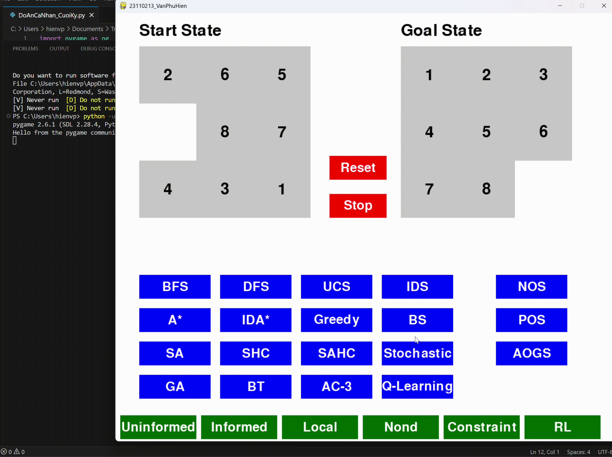

# Đồ án cá nhân cuối kỳ - AI

## Mục tiêu

Tìm hiểu, triển khai và đánh giá hiệu suất của các thuật toán tìm kiếm áp dụng vào giải bài toán **8-puzzle** — yêu cầu sắp xếp lại các ô số từ trạng thái ban đầu (Start State) sao cho đúng với trạng thái đích (Goal State) thông qua các hành động di chuyển hợp lệ.

Giao diện đồ họa (GUI) của chương trình được xây dựng bằng thư viện **Pygame**

> Sinh viên thực hiện [Văn Phú Hiền - 23110213](#)

### Minh họa trạng thái

| Start State | Goal State |
|--------------------|---------------------|
|  |  |

## Mục lục

- [I. Uninformed Search Algorithms](#i-uninformed-search-algorithms)  
  - [1. bfs – Breadth-First Search](#1-bfs--breadth-first-search)  
  - [2. dfs – Depth-First Search](#2-dfs--depth-first-search)  
  - [3. ucs – Uniform Cost Search](#3-ucs--uniform-cost-search)  
  - [4. ids – Iterative Deepening Search](#4-ids--iterative-deepening-search)  

- [II. Informed Search Algorithms](#ii-informed-search-algorithms)  
  - [1. a_star – A* Search](#1-a_star--a-search)  
  - [2. greedy – Greedy Best-First Search](#2-greedy--greedy-best-first-search)  
  - [3. ida_star – Iterative Deepening A*](#3-ida_star--iterative-deepening-a)  

- [III. Local Search Algorithms](#iii-local-search-algorithms)  
  - [1. SHC – Simple Hill Climbing](#1-SHC--simple-hill-climbing)  
  - [2. SAHC – Steepest Ascent Hill Climbing](#2-SAHC--steepest-ascent-hill-climbing)  
  - [3. Stochastic – Stochastic Hill Climbing](#3-Stochastic--stochastic-hill-climbing)  
  - [4. SA – Simulated Annealing](#4-SA--simulated-annealing)  
  - [5. BS – Beam Search](#5-BS--beam-search)

## I. Uninformed Search Algorithms

### 1. bfs – Breadth-First Search

### 2. dfs – Depth-First Search

### 3. ucs – Uniform Cost Search

### 4. ids – Iterative Deepening Search

---

## II. Informed Search Algorithms

### 1. a_star – A* Search

### 2. greedy – Greedy Best-First Search

### 3. ida_star – Iterative Deepening A*

---

## III. Local Search Algorithms

### 1. SHC – Simple Hill Climbing

### 2. SAHC – Steepest Ascent Hill Climbing

### 3. Stochastic – Stochastic Hill Climbing

### 4. SA – Simulated Annealing

### 5. BS – Beam Search

